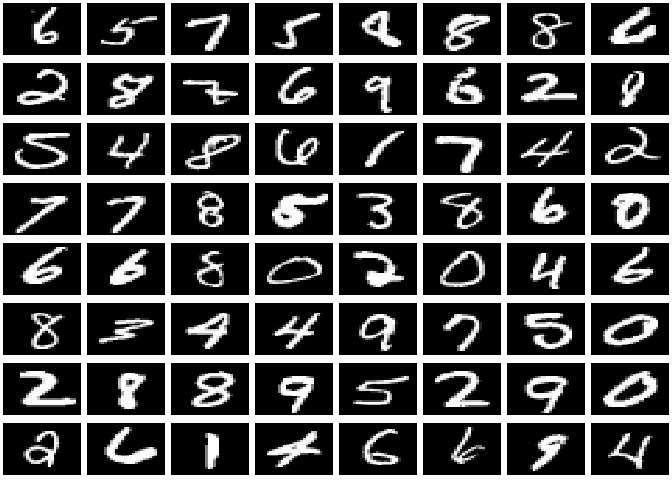
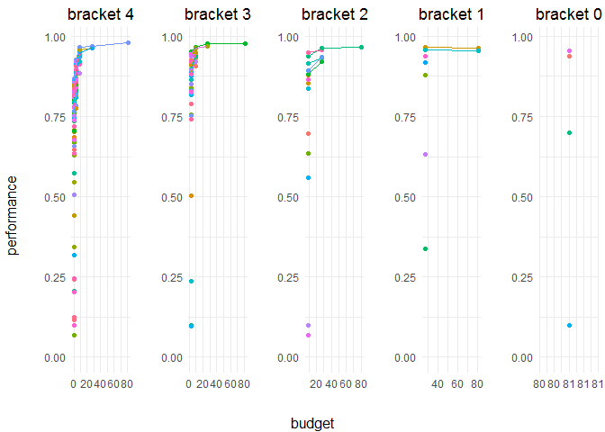

hyperband in R6
===============

This is a very generic R6 implementation of the hyperband algorithm for hyperparameter optimization (<https://arxiv.org/pdf/1603.06560.pdf>)

The project is not yet finished but can already be used on your own problems and should work with any other R package/algorithm as long as it is suitable for hyperband.

### Please check the vignette folder for a very in-depth explanation + exhaustive examples, including a "how-to" computing single bracket objects or even combining hyperband with MBO.
--------------------------------------------------------------------------------------------------------------------------------------------------------------------------------------------------------------

------------------------------------------------------------------------

Let us use **hyperbandr** in order to tune the hyperparameters of a neural network on the famous MNIST data (LeCun & Cortes 2010).

To this, we use [mxnet](https://github.com/apache/incubator-mxnet/tree/master/R-package) and [mlr](https://github.com/mlr-org/mlr).



For convenience, we only use 1/10 of the original data.

``` r
# We sample 2/3 of our data for training
train.set = sample(nrow(mnist), size = (2/3)*nrow(mnist))

# Another 1/6 will be used for validation during training
val.set = sample(setdiff(1:nrow(mnist), train.set), 1000)

# The remaining 1/6 will be stored for testing
test.set = setdiff(1:nrow(mnist), c(train.set, val.set))

# Since we use mlr, we define a classification task to encapsulate the data
task = makeClassifTask(data = mnist, target = "label")

# Finally, we define the problem list
problem = list(data = task, train = train.set, val = val.set, test = test.set)
```

At first we define a search space. The ParamHelpers package provides an easy way to construct the latter one.

``` r
library("ParamHelpers")
configSpace = makeParamSet(
  makeDiscreteParam(id = "optimizer", values = c("sgd", "rmsprop", "adam", "adagrad")),
  makeNumericParam(id = "learning.rate", lower = 0.001, upper = 0.1),
  makeNumericParam(id = "wd", lower = 0, upper = 0.01),
  makeNumericParam(id = "dropout.input", lower = 0, upper = 0.6),
  makeNumericParam(id = "dropout.layer1", lower = 0, upper = 0.6),
  makeNumericParam(id = "dropout.layer2", lower = 0, upper = 0.6),
  makeNumericParam(id = "dropout.layer3", lower = 0, upper = 0.6),
  makeLogicalParam(id = "batch.normalization1"),
  makeLogicalParam(id = "batch.normalization2"),
  makeLogicalParam(id = "batch.normalization3")
)
```

Now we need a function to sample configurations from our search space.

``` r
sample.fun = function(par.set, n.configs, ...) {
  # sample from the par.set and remove all NAs
  lapply(sampleValues(par = par.set, n = n.configs), function(x) x[!is.na(x)])
}
```

.. as well as a function to initialize models ..

``` r
init.fun = function(r, config, problem) {
  lrn = makeLearner("classif.mxff",
    # you may have to install mxnet gpu, else just set ctx = mx.cpu()
    ctx = mx.gpu(),
    # we define a small CNN architecture with two conv and two dense layers
    # (the second dense layer is our output and will be created automatically by mlr)
    layers = 3, 
    conv.layer1 = TRUE, conv.layer2 = TRUE,
    conv.data.shape = c(28, 28),
    num.layer1 = 8, num.layer2 = 16, num.layer3 = 64,
    conv.kernel1 = c(3,3), conv.stride1 = c(1,1), 
    pool.kernel1 = c(2,2), pool.stride1 = c(2,2),
    conv.kernel2 = c(3,3), conv.stride2 = c(1,1), 
    pool.kernel2 = c(2,2), pool.stride2 = c(2,2),           
    array.batch.size = 128,
    # we initialize our model with r iterations
    begin.round = 1, num.round = r,
    # here we allocate the configuration from our sample function
    par.vals = config
  )
  mod = train(learner = lrn, task = problem$data, subset = problem$train)
  return(mod)
}
```

After each step of successive halving, hyperbandr continues training the remaining model instead of training from scratch. This will greatly speed training time. Thus, we need a function to continue the training of our models ..

We're planning to add training from scratch as well. That might be necessary if the architecture memory requirements become to big.

``` r
train.fun = function(mod, budget, problem) {
  # we create a new learner and assign all parameters from our model
  lrn = makeLearner("classif.mxff", ctx = mx.gpu(), par.vals = mod$learner$par.vals)
  lrn = setHyperPars(lrn,
    # in addition, we have to extract the weights and feed them into our new model 
    symbol = mod$learner.model$symbol,
    arg.params = mod$learner.model$arg.params,
    aux.params = mod$learner.model$aux.params,
    begin.round = mod$learner$par.vals$begin.round + mod$learner$par.vals$num.round,
    num.round = budget
  )
  mod = train(learner = lrn, task = problem$data, subset = problem$train)
  return(mod)
}
```

.. and last but not least a function to measure the performance of our model at each step of successive halving:

``` r
performance.fun = function(model, problem) {
  # predict the validation data
  pred = predict(model, task = problem$data, subset = problem$val)
  # we choose accuracy as our performance measure
  performance(pred, measures = acc)
}
```

Now we can call hyperband (with these hyperparameters, one run needs like 5 minutes on a GTX 1070):

``` r
hyperhyper = hyperband(
  problem = problem,
  max.resources = 81, 
  prop.discard = 3,
  max.perf = TRUE,
  id = "nnet", 
  par.set = configSpace, 
  sample.fun =  sample.fun,
  init.fun = init.fun,
  train.fun = train.fun, 
  performance.fun = performance.fun)
#> Beginning with bracket 4
#> Iteration 0, with 81 Algorithms left (Budget: 1)
#> Iteration 1, with 27 Algorithms left (Budget: 3)
#> Iteration 2, with 9 Algorithms left (Budget: 9)
#> Iteration 3, with 3 Algorithms left (Budget: 27)
#> Iteration 4, with 1 Algorithms left (Budget: 81)
#> Beginning with bracket 3
#> Iteration 0, with 34 Algorithms left (Budget: 3)
#> Iteration 1, with 11 Algorithms left (Budget: 9)
#> Iteration 2, with 3 Algorithms left (Budget: 27)
#> Iteration 3, with 1 Algorithms left (Budget: 81)
#> Beginning with bracket 2
#> Iteration 0, with 15 Algorithms left (Budget: 9)
#> Iteration 1, with 5 Algorithms left (Budget: 27)
#> Iteration 2, with 1 Algorithms left (Budget: 81)
#> Beginning with bracket 1
#> Iteration 0, with 8 Algorithms left (Budget: 27)
#> Iteration 1, with 1 Algorithms left (Budget: 81)
#> Beginning with bracket 0
#> Iteration 0, with 1 Algorithms left (Budget: 81)
```

With max.resources = 81 and prop.discard = 3, we obtain a total of 5 brackets:

``` r
length(hyperhyper)
#> [1] 5
```

We can inspect the first bracket ..

``` r
hyperhyper[[1]]
#> <Bracket>
#>   Public:
#>     adjust: 27
#>     B: 405
#>     bracket.storage: BracketStorage, R6
#>     clone: function (deep = FALSE) 
#>     configurations: list
#>     filterTopKModels: function (k) 
#>     getBudgetAllocation: function () 
#>     getNumberOfModelsToSelect: function () 
#>     getPerformances: function () 
#>     getTopKModels: function (k) 
#>     id: nnet
#>     initialize: function (problem, max.perf, max.resources, prop.discard, s, 
#>     iteration: 4
#>     max.perf: TRUE
#>     max.resources: NULL
#>     models: list
#>     n.configs: 1
#>     par.set: ParamSet
#>     printState: function () 
#>     prop.discard: 3
#>     r.config: 1
#>     run: function () 
#>     s: 4
#>     sample.fun: NULL
#>     step: function () 
#>     visPerformances: function (make.labs = TRUE, ...)
```

.. and for instance check it's performance by calling the getPerformance() method:

``` r
hyperhyper[[1]]$getPerformances()
#> [1] 0.973
```

We can also inspect the architecture of the best model of bracket 1:

``` r
hyperhyper[[1]]$models[[1]]$model
#> Model for learner.id=classif.mxff; learner.class=classif.mxff
#> Trained on: task.id = mnist; obs = 4000; features = 784
#> Hyperparameters: learning.rate=0.0504,array.layout=rowmajor,verbose=FALSE,optimizer=adagrad,wd=0.00229,dropout.input=0.0428,dropout.layer1=0.0317,dropout.layer2=0.183,dropout.layer3=0.392,batch.normalization1=FALSE,batch.normalization2=FALSE,batch.normalization3=TRUE,ctx=<MXContext>,layers=3,conv.layer1=TRUE,conv.layer2=TRUE,conv.data.shape=28,28,num.layer1=8,num.layer2=16,num.layer3=64,conv.kernel1=3,3,conv.stride1=1,1,pool.kernel1=2,2,pool.stride1=2,2,conv.kernel2=3,3,conv.stride2=1,1,pool.kernel2=2,2,pool.stride2=2,2,array.batch.size=128,begin.round=28,num.round=54,symbol=<Rcpp_MXSymbol>,arg.params=<list>,aux.params=<list>
```

Let's see which bracket yielded the best performance:

``` r
lapply(hyperhyper, function(x) x$getPerformances())
#> [[1]]
#> [1] 0.973
#> 
#> [[2]]
#> [1] 0.963
#> 
#> [[3]]
#> [1] 0.947
#> 
#> [[4]]
#> [1] 0.96
#> 
#> [[5]]
#> [1] 0.961
```

We can call the hyperVis function to visualize all brackets:

``` r
hyperVis(hyperhyper, perfLimits = c(0, 1))
```



Now we use the best model and predict test data:

``` r
best.mod.index = which.max(unlist(lapply(hyperhyper, function(x) x$getPerformances())))
best.mod = hyperhyper[[best.mod.index]]$models[[1]]$model

performance(predict(object = best.mod, task = problem$data, subset = problem$test), 
            measures = acc)
#>   acc 
#> 0.982
```

### The example folder contains six detailed examples:

-   neural networks:
    -   hyperband to tune hyperparameters with mxnet and mlr
    -   combine hyperband and MBO to tunehyperparameters with mxnet, mlr and mlrMBO
-   gradient boosting:
    -   hyperband to tune hyperparameters with xgboost and mlr
    -   combine hyperband and MBO to tunehyperparameters with xgboost, mlr and mlrMBO
-   single- and multi-objective functions:
    -   hyperband to tune hyperparameters with smoof and mlr
    -   combine hyperband and MBO to tunehyperparameters with smoof mlr, and mlrMBO
